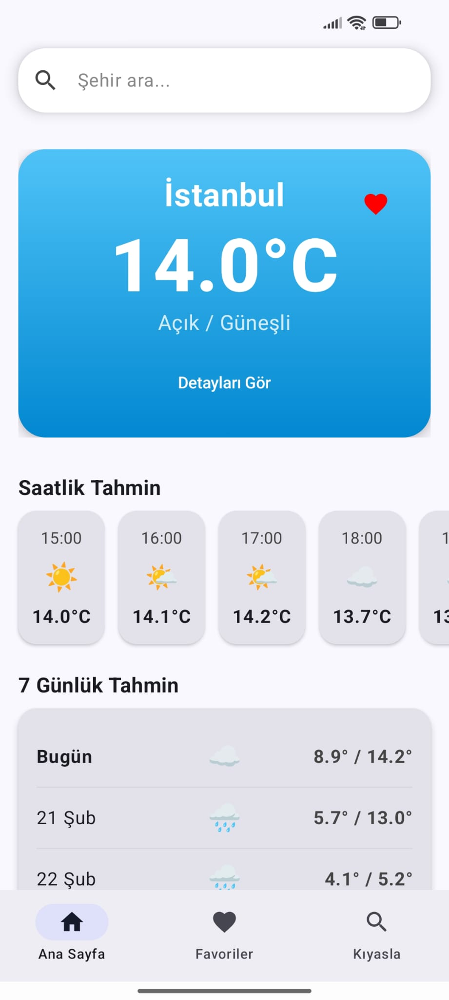
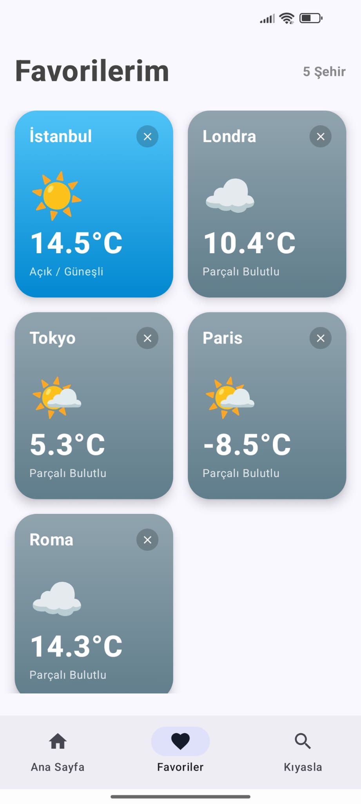
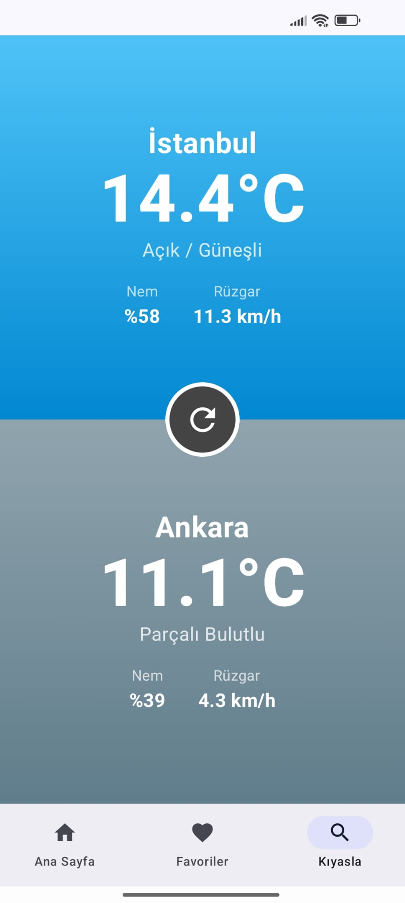
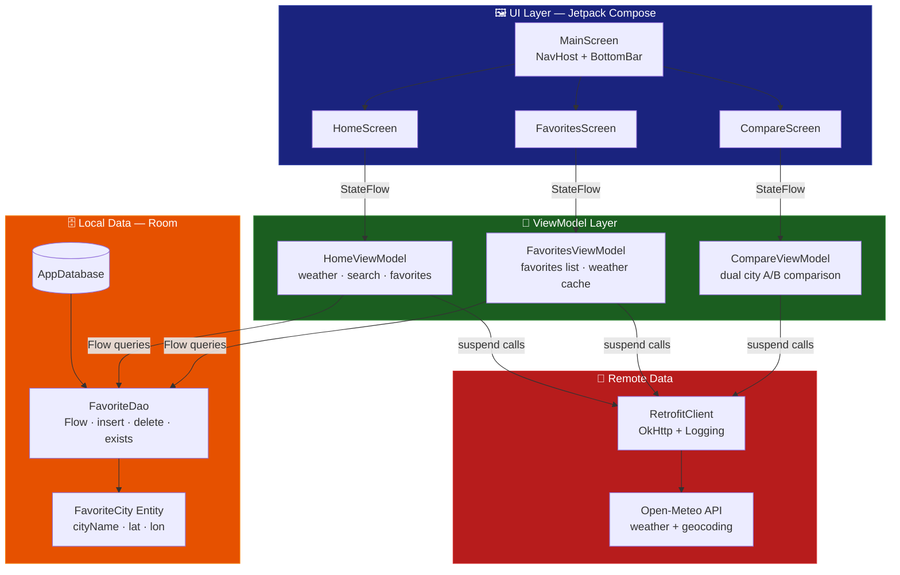
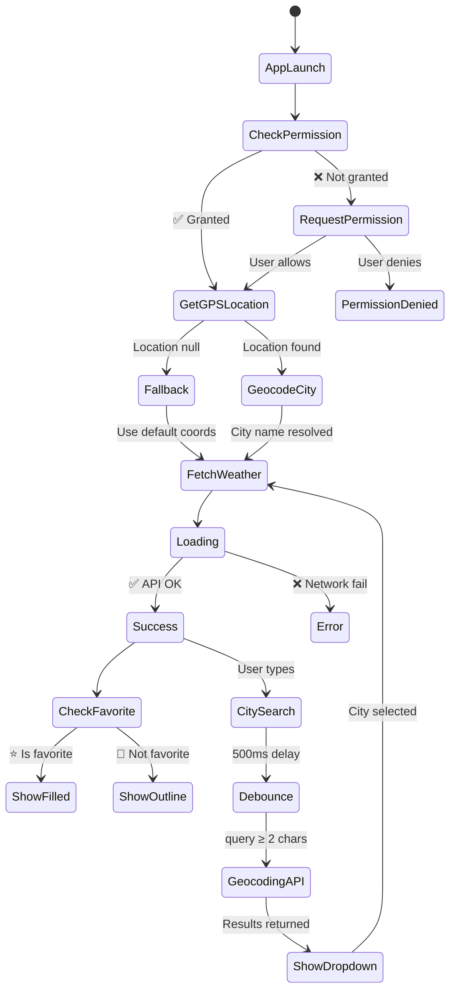
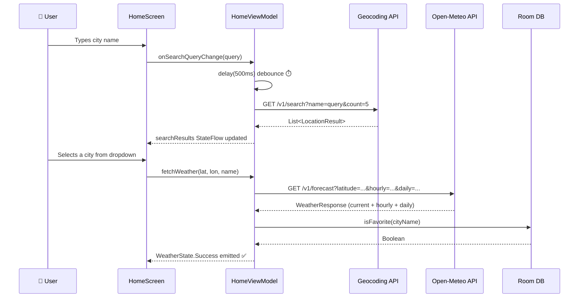
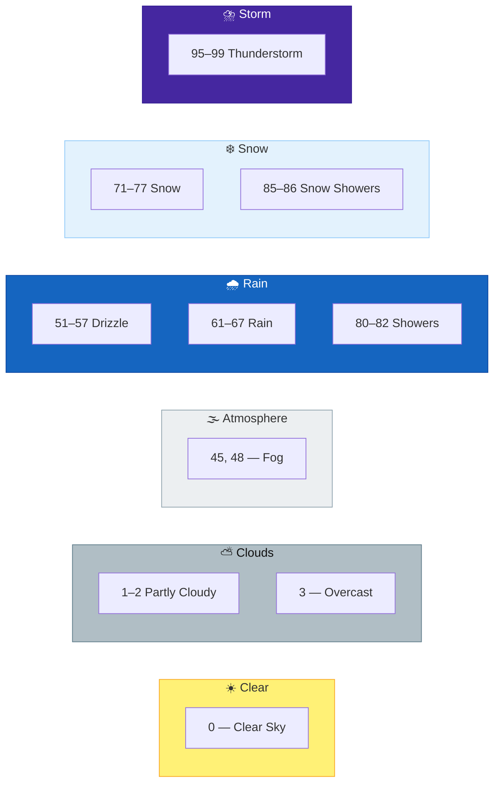
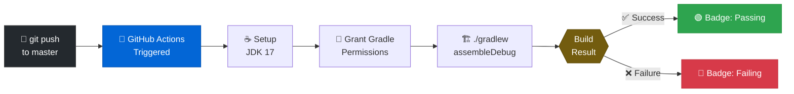

<div align="center">


<br/>

[](https://github.com/berat-karabuga/Mini-Weather-Fetcher/actions)&nbsp;
&nbsp;
&nbsp;
&nbsp;
&nbsp;


<br/>

```
☀️  Live weather  •  📊 24h forecasts  •  📅 7-day outlook  
⭐  Save favorites  •  ⚔️  Compare cities  •  📍 GPS-powered
```

</div>

---

<div align="center">

## ⚡ Why Mini Weather Fetcher?

</div>

```
🚀  No API key required          — Open-Meteo is completely free & open
📍  Auto GPS detection           — Opens straight to your location  
⚡  Debounced city search        — Fast, smart, no redundant API spam
🗄️  Room persistence             — Favorites survive app restarts
🎨  Weather-adaptive UI          — Gradients shift with live conditions
🔄  CI/CD via GitHub Actions     — Every commit is built & verified
```

---

## 📸 Screenshots

<div align="center">

<table>
  <tr>
    <td align="center" width="33%">
      <br/>
      <sub><b>🏠 Home Screen</b></sub><br/>
      <sub>GPS auto-detect · live weather<br/>hourly forecast · 7-day outlook</sub>
    </td>
    <td align="center" width="33%">
      <br/>
      <sub><b>⭐ Favorites Screen</b></sub><br/>
      <sub>City grid · weather-adaptive cards<br/>one-tap switch · persistent storage</sub>
    </td>
    <td align="center" width="33%">
      <br/>
      <sub><b>⚔️ Compare Screen</b></sub><br/>
      <sub>Split-screen battle · live gradients<br/>humidity & wind side-by-side</sub>
    </td>
  </tr>
</table>

</div>

> 📁 Screenshots are located in the [`screenshots/`](./screenshots) folder of the repository.

---

## 🗺️ Architecture Overview



---

## 🔄 App State Machine



---

## 🌐 API Request Flow



---

## 📁 Project Structure

```
📦 com.stargazer.miniweatherfetcher
│
├── 📂 components/
│   ├── 🧩 CitySearchBar.kt        ← Debounced input + animated result dropdown
│   └── 🧩 WeatherCard.kt          ← Expandable card with weather-adaptive gradients
│
├── 📂 data/
│   ├── 🌐 RetrofitClient.kt       ← Singleton + OkHttp logging interceptor
│   ├── 🌐 WeatherApi.kt           ← Retrofit interface (weather + geocoding)
│   └── 📂 local/
│       ├── 🗄️ AppDatabase.kt      ← Room DB definition
│       ├── 🗄️ FavoriteCity.kt     ← @Entity (cityName PK, lat, lon)
│       └── 🗄️ FavoriteDao.kt      ← Flow queries, insert, delete, exists
│
├── 📂 model/
│   ├── 📋 WeatherResponse.kt      ← CurrentWeather + HourlyForecast + DailyForecast
│   └── 📋 GeocodingResponse.kt    ← LocationResult with coordinates
│
├── 📂 navigation/
│   ├── 🗺️ Routes.kt               ← @Serializable type-safe destinations
│   └── 🗺️ BottomNavItem.kt        ← Nav item wrapper model
│
├── 📂 screens/
│   ├── 🖥️ MainScreen.kt           ← Scaffold, shared ViewModel, NavHost
│   ├── 🖥️ HomeScreen.kt           ← GPS + search + hourly LazyRow + daily Card
│   ├── 🖥️ FavoritesScreen.kt      ← LazyVerticalGrid + PremiumFavoriteCards
│   └── 🖥️ CompareScreen.kt        ← Split-screen battle + animated VS button
│
├── 📂 utils/
│   └── 🛠️ WeatherUtils.kt         ← getWeatherEmoji() · getWeatherDescription() · formatDate()
│
├── 📂 viewmodel/
│   ├── 🧠 HomeViewModel.kt        ← WeatherState sealed class + toggleFavorite
│   ├── 🧠 FavoritesViewModel.kt   ← stateIn() + weatherMap lazy caching
│   └── 🧠 CompareViewModel.kt     ← A/B city state + parallel fetch + reset
│
└── 🚀 MainActivity.kt             ← DatabaseProvider.init() + enableEdgeToEdge()
```

---

## 🌤️ WMO Weather Code Reference



---

## 🛠️ Tech Stack

| Layer | Technology | Purpose |
|-------|-----------|---------|
| Language |  | 100% Kotlin codebase |
| UI |  | Declarative modern UI |
| Architecture | MVVM + StateFlow | Reactive, lifecycle-aware state |
| Navigation | Compose Navigation | `@Serializable` type-safe routes |
| Networking | Retrofit2 + OkHttp | REST API + logging interceptor |
| Serialization | Kotlinx Serialization | Efficient JSON parsing |
| Local DB | Room | Favorite city persistence |
| Location | FusedLocationProvider | Precise + battery-efficient GPS |
| Geocoding | Android Geocoder | Coords → Human-readable city name |
| Weather API | [Open-Meteo](https://open-meteo.com/) | Free, no API key, highly accurate |
| CI/CD | GitHub Actions | Auto build on every push |

---

## ⚙️ CI/CD Pipeline



---

## 🚀 Quick Start

### Prerequisites
- Android Studio **Hedgehog** or newer
- Android SDK **26+**
- Device/emulator with Google Play Services

### Steps

```bash
# 1. Clone
git clone https://github.com/berat-karabuga/Mini-Weather-Fetcher.git
cd Mini-Weather-Fetcher

# 2. Open in Android Studio
# File → Open → Select folder → Sync Now

# 3. Build via terminal (optional)
./gradlew assembleDebug

# 4. Run on device
# ▶ in Android Studio or adb install
```

> ✅ **Zero configuration.** No `.env`, no API keys, no secrets. Just clone and run.

---

## 📱 Runtime Permissions

| Permission | Reason |
|-----------|--------|
| `ACCESS_FINE_LOCATION` | Precise GPS for automatic weather detection |
| `ACCESS_COARSE_LOCATION` | Fallback approximate location |
| `INTERNET` | Live weather + city search API calls |

---

## 🔮 Roadmap

- [ ] 🌡️ Fahrenheit / Celsius toggle
- [ ] 🌙 Dynamic dark mode
- [ ] 🔔 Background weather alerts
- [ ] 📍 Home screen widget
- [ ] 📊 Interactive temperature trend charts
- [ ] 🌍 EN / TR full language switch
- [ ] 🗺️ Map-based city picker
- [ ] 💾 Offline cached weather fallback

---

## 🤝 Contributing

```bash
git checkout -b feature/your-feature
git commit -m "feat: describe your change"
git push origin feature/your-feature
# → Open a Pull Request
```

Commit prefixes: `feat:` · `fix:` · `refactor:` · `docs:` · `chore:`

---

<div align="center">


**Made with ❤️ + ☕ + Kotlin**

[](https://github.com/berat-karabuga)

*If this project was useful to you, a ⭐ goes a long way!*

</div>
